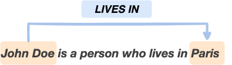
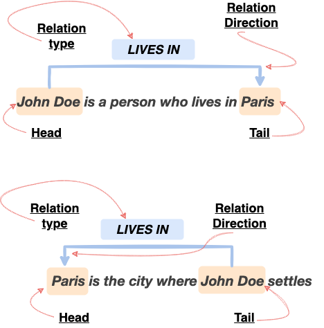
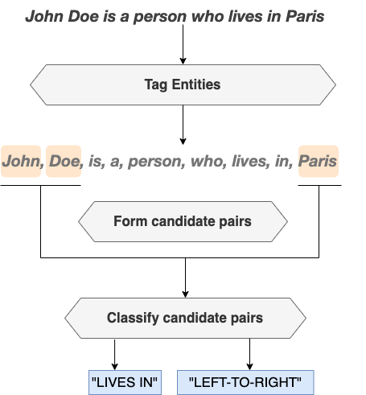

What is semantic relation extraction?
======================================

In (NLP) (Natural Language Processing), semantic relation extraction or simply relation extraction is the task of extracting semantic relationships from a given piece of text.
Extracted relationships usually occur between two or more entities of a certain type (e.g. person, country, region, music instrument, etc.) and fall into a number of semantic categories (e.g. has nationality, plays, located in, etc.)

   In this example of sentence, we can understand that the text entity "John Doe" is related to the text entity "Paris" by the semantic relation of category: "LIVES IN".

Efficient encoding of semantic relations
=============================================

**In binary relations**, i.e when the studied relations can always be assumed to happen between **a group (pair) of - exactly two - entities** of the studied piece of text, information about that relation can be easily encoded using a quadruplet: *(head_entity, tail_entity, relation_type, relation_direction)*.

   * *head_entity*: the entity that is the head of the pair's relation, chsoen to be the one that appears on the left side of the sentence.
   * *tail_entity*: the entity that is the tail of the pair's relation, i.e the entity which appears on the right side of the sentence.
   * *relation_type*: the type of the relation occurring between the (group) two entities.
   * *relation_direction*: the direction of the relation, whether it's read from "left to right" (from head to tail), or inversely from "right to left" (from tail to head).

Please do not confuse the concept of *binary relation* introduced here, and that fixes the *number of entities per related group* to two and in which case the group is simply refered to as pair, with the *number of tokens forming a group entity*. In fact, entities must always be seen as spans of tokens, with one or potentially more contiguous tokens defining the entity, and that makes sense; to cover all possible natural forms of entities, often being multi-tokens like the entity "John Doe" in the examples below.

In the text **"John Doe is a person who lives in Paris"**: 
The tuple *(head_entity="John Doe", tail_entiy="Paris", relation_type="lives-in", relation_direction="left-to-right")* is an example of such an encoding for the semantic relation of type *"lives-in"*, happening between the *head_entity* *"John Doe"*, because it appears on left side of the sentence, and the *tail_entity* *"Paris"*, because it appears on the right side of the sentence. It's directed from head to tail, meaning: *"head_entity" --- "lives-in" ---> "tail_entity"*, or in other words: *"John Doe lives in Paris"*. 

Now consider the following: **"Paris is the city where John Doe settles"**:
Note that the relation direction is inversed, to illustrate the meaning of *relation_direction* attribute in the suggested enconding and clarify what *head_entity* and *tail_entity* attributes are used for. 
The tuple *(head_entity="Paris", tail_entity="John Doe", relation_type="lives-in", relation_direction="right-to-left")* can again be taken as an encoding for the semantic relation "lives-in", happening between the *head_entity* *"Paris"*, because it appears on left side of the sentence, and the *tail_entity* *"John Doe"*, because it appears on the right side of the sentence. Again, it's directed, but from tail to head, meaning: *"tail_entity" -- "lives-in" --> "head_entity"*, or in other words: *"John Doe lives in Paris"*.

   
In this figure we illustrate the 'shallow' annotation scheme of semantic relations, and how that could be used to encode the relationship between the entities "Paris" and "John Doe" in both text examples.

Please note that this type of annotation is simple and straightforward to establish, and it assumes no theoritical or grammatical knowledge about the text and the studied relations. Instead, it is a light and *superficial* way of encoding information about occuring relations, consequently enabling faster creation of custom learning corpora. *Superficial* here means that annotations focus on the linguistic *forms* (forms of the tokens of the text and how they're written) implied in relations rather than building representations of those on top of sophisticated grammar-based rules.

Simplifying the relation extraction problem
====================================================

A common approach to solving the semantic relation extraction problem is to divide it into a set of partial problems, each of which should be easily addressed by a separate module.
The figure below illustrates the global workflow of such modular approach for the semantic relation extraction problem, which is based on the following three sub-modules:

   **Entities tagging**: 
   A first module outputs a discriminative tag for each single token of the input sentence, to say whether it's part of an interesting entity, or not, allowing to identify entities in the text that would potentially form related groups (pairs) in the sense of the studied relationship.
   
   **Forming candidate groups (pairs)**: 
   A second module forms candidate groups (pairs) of entities from the output of the first module. For that, it must follow some heuristics, e.g the naive strategy of forming *all distinct* pairs of previously identified entities.
   
   **Relation extraction**: 
   A third module classifies previously formed candidate groups (pairs) into the relations types and/or directions of the studied relationship.

   
   
Programming a conventional relation extraction system
========================================================
According to the common approach presented above, a program that is able to extract semantic relations from text is a modular system that should be able to:
   
   * **Tag** interesting entities in the text, in the sense of the studied relations.
   * **Form** candidate groups (pairs) of those entities.
   * **Classify** the relations between the entities in the candidate groups (pairs).

Many challenging questions might arise during the design of each of the previous blocks, and one essential question is: How to write a program to fulfill each step's requirements ? Said differently, is it simply possible to come up with a feasible deterministic algorithm to do the job ? Or shall we try some predictive methods instead, namely when things become untractable in a certain way?

* For the tagging task we can fairly assume that determinstic programming can't be very useful, because the entities' forms are not all known in advance - natural language is diverse - to be wholly hard-captured and tested-against in some determinstic program, even if tagging rules are known and not hard to use in a determinstic manner. Therefore, a system must be able to identify useful entities in the text, taking into account the diversity of natural language in the sense that the same meaning can be expressed in different (syntactically) similar (semantically) ways, and to tag them with a convenient tag in a *predictive* fashion.

* Forming candidate pairs can be obviously achieved both ways. The dummy way, where all possible groups (pairs) of entities are formed, is a straightforward example of deterministic candidate groups (pairs) selection method. Using some predictive heuristic to select groups (pairs) based on some statistical model is another interesting option.

* Here again, tackling the classification task of candidate groups (pairs) the deterministic way is problematic, for the same natural-text diversity reason cited in first point above; diverse entities forms means diverse groups (pairs) forms. Moreover, classifying candidate groups (pairs) of entities would always require some features generation step with costly assumptions on how to generate them in order to characterize efficiently each possible group (pair)'s type and/or direction, which is a non-trivial task when done manually; i.e the deterministic way, and even using hand-crafted predictive methods.

.. figure:: images/four.png
   :scale: 80 %
   :align: center

Deep learning as core programming paradigm
========================================================================
We've seen in the previous paragraph why deterministic programming cannot be a viable option for solving the semantic relation extraction problem.
For instance, we've seen that it's not adequate neither for the tagging sub-task, nor for the candidate group (pair) classification sub-task due to natural language diversity.

In order to solve the sub-task of tagging entities of interest, using an efficient predictive method is actually a must, and that's where machine learning methods come in. 
Nowadays, having access to a relatively large corpus of easy-to-construct annotated sentences with respect to some specific relationships, you have just to choose your favorite deep neural-based sequence tagging architecture, invoke an instance of it and make it learn to predict the tags of the entities (a.k.a heads an tails, c.f 2nd Paragraph in this page) in future new sentences. That's referred to as *sequence tagging*, which is a very common task in natural language processing and where deep learning has been shown to be a very effective - programming - method.

As for the task of groups (pairs) classification, it is all the more favored by the success of deep learning, because the latter not only helps us avoid problems related to the diversity of natural language, which is impossible to capture simply by a deterministic program, but above all it allows us to automate the phase of features generation, and thus avoid the cost of hand crafting them. These will be learned automatically in the latent layers of some ready to transfer deep neural-based language models, instead of being built manually or under expensive assumptions. Then, a feed-forward neural network classifier is generally trained on pre-annotated samples of sentences to learn how predict the effective relation type and/or direction for future similar candidate groups (pairs) of entities.

The strategy of choosing candidate groups (pairs) at the entrance of the classifier is a critical part of the final relation extraction system. It is a matter of how to select the best candidate pairs from the output of the first tagging module before providing them to the last module.
As explained above, we can use a naive strategy of forming all possible candidate pairs, but this is not the best way to do it since, without further considerations, it would essentially propagate errors to the next - classification - step.
Alternatively, one can use a data-driven heuristic, i.e based on learning from data, and again that could be best done, with minimal efforts, under a deep learning setting.

.. figure:: images/five.png
   :scale: 80 %
   :align: center

Mainspring of the project
============================================

The branch of research world world that is interested in deep'**' semantic relations extraction, just like any other research field in (AI) and ((NLP)), is constantly evolving:
there would be always a new best architecture for that specific sub-task, or a new best learning scheme for the other sub-task, etc. But the global solving framework, i.e the three-stages modular program presented above, remains globally unchanged. 
The objective behind these continuous updates people who are interested in relation extraction should want to keep receiving from the R&D world is obviously to improve the efficiency of the final system in solving the task. 
But those are not necessarily easy to access and/or integrate by large public for various reasons. 

Bridging this gap between R&D and industry applications of semantic relation extraction, and pacing direct application of the new knowledge emerging in the field of automatic relation extraction is the essence of relex project.

Relex is first of all made for people who are interested in quickly building deep and efficient relation extraction systems adapted for their specific needs.

It leverages the simplicity of modern'*' *superficial* semantic relations annotation/encoding schemes, such as the one introduced above, and emphasizes their efficiency in building custom learning corpora with respect to custom relations of interest with minimal annotation efforts.

It equally emphasizes the efficiency of using deep'**' data-driven approaches to program solving the sub-tasks implied in the semantic relation extraction problem as presented above, by building system components that are able to efficiently learn from previously annotated data.

Concretely and more importantly, it aims to provide minimal and intuitive packaged coding interfaces to help people develop their own efficient relation extraction systems based on state-of-the-art deep-learning-based methods'**' of the subject matter.

'*' in comparaison with other *classic* *(old)* annotation schemes, where sophisticated linguistic and grammar-based approaches are used to encode/annotate relation information in a given piece of text.

'**' off-the-shelf deep neural networks and corresponding learning and schemes along with best learning and coding practices.

Bringing together applied research and good coding  practice
=============================================================

From the standpoint of practical research, sticking to the global three-stages architecture and attempting to answer the following issues may result in a new effective, and performant approach to deep semantic relation extraction, and this is how we expect relex to mature and become more useful as project (package):

**How to efficiently encode and use semantic relations information:** 

Using a shallow labeling method such as the one described above. 

The role of the ``relex.data`` sub-package is to provide easy and efficient ways for loading and using such instances of annotated samples in both development (learning) and production (prediction) modes of the relation extraction system.

**Which text embedding techniques to transfer and use:** 

The increased availability of sophisticated numerical text representations with rich semantic information known as embeddings has contributed significantly to the success of deep learning in (NLP). 
Almost any (NLP) program currently uses various embedding approaches to deliver consistent results on downstream tasks. This practice is commonly known as trasnfer learning. In our scenario, we'll inevitably need to leverage and use such representations in our relation extraction downstream sub-tasks, namely the sequence tagging and groups (pairs) classification parts. 
One wishes to take advantage of the large language models that have been publicly released and made accessible for usage by significant research teams for this purpose. 
To build our downstream relation extraction tasks, we might want to utilize:  Word2vec, Glove, FastText, ELMo, GPT, BERT, XLNet, or FLAIR, etc. 
These are static and dynamic embedding families, and each one offers advantages. Combining them has been shown to be wise because it improves predicting abilities. 
It will be challenging for non-technical people to use and apply these, nevertheless. 

Fortunately, developing a straightforward and efficient interface for loading and using such off-the-shelf embeddings in nowadays a matter of few lines of code thanks to other amazing open-source projects like Flair and hugging face Transformers. 
Among others, the role of ``relex.utilities`` sub-package is to host such helpful interfaces that would facilitate direct application of those in our custom depp relation extraction systems.

**Which sub-tasks to solve in a deep-learning setting:** 

Roughly speaking, both the tagging and classification sub-parts of a conventional relation extraction system must be treated as learnable tasks. 
Candidate groups (pairs) forming sub-task can however be done in a deterministic way. 
Under any setting (learnable groups (pair) forming setting included), a crucial question is to choose whether to learn the (learnable) sub-components of the system separately, or to learn a jointure of them. 
That leads to another crucial distinction ``joint-learning`` versus ``separate-learning`` that might differ from one proposed deep relation extraction solution to another.

Additionally, if for instance we choose to build separately one of the sub-modules of the system, then we would need to wrap the final learned components into a single deterministic wrapper routine that would be used in production time to put everything together and output the final desired predictions.
The role of ``relex.predictors`` sub-package is to host such procedures when implied in the approach being followed.

**What deep architectures to use in each trainable sub-task:** 

For instance, the entities tagging sub-task can be efficiently solved using the famous BiLSTM-CRF sequence tagging architecture, trained in a fully-supervised manner on a large annotated corpus of sentences.
Candidate groups (pairs) classification on the other hand can be solved using a feed-forward neural network classifier, learned in a fully-supervised manner on top of some BERT-like transferred embedding layers, on a relatively large annotated corpus of groups (pairs) of entities.

``relex.models`` is the intended home (sub-package) for such ready-to-istantiate and easy-to-configure models.
Please keep in mind that there would be certainly many other approaches that are more data-efficient and more performant for each sub-task; cf. next point.

**How to train them with minimal annotation effort:** 

New learning strategies are continually being developed by experts in the field of deep learning-based relation extraction, and they are anticipated to increase both the effectiveness of the final system and the entire development (learning) process of the solution. 
For instance, there are increasing efforts to lessen the number of annotated learning examples needed in such deep settings in order to effectively develop good components without needing too many data samples, which are sometimes difficult to satisfy in real-life situations for the reason that it is frequently an expensive process. 
The development of various new meta-learning algorithms, which have been demonstrated to outperform the majority of ``conventional supervised learning`` methods on comparable tasks with fewer (and occasionally no) labeled data, is one effort in that direction. 
``Few-Shot learning`` is a typical illustration of that. 
If someone tries to construct custom deep relation extraction components in one of these ecosystems, he will eventually need access to new architectures and learning methods.

In order to continuously help people create a potent relation extraction system, the relex package aims to incorporate and enable the direct and accurate application of such learning schemes, their associated model architectures, and the essential needs to correctly learn, validate, and test them, as they emerge and become relevant.

**What are best learning practises:** 

In reality, there are other factors that must be taken into consideration in order to create a deep relation extraction system that works well.
If not done carefully, a number of additional critical elements could have a direct detrimental impact on the performance of the system's sub-components. Deep architectures taken directly from the literature require specific programming abilities and are difficult to reproduce. Additionally, even though such models are simple to instantiate, a person who lacks experimentation curiosity is still prone to making mistakes, especially during the design of data-driven learning loop steps: he may fail to properly set the optimizers, be unfamiliar with the good advised internals of learning loops, omit to evaluate, test, or save models checkpoints, choose the wrong evaluation metrics, etc.

For that, in relex, we intend to populate the ``relex.learners`` sub-package with handy and correct learning routines for every supported approach.

**Isn't the code too complex?** 

For reading and reusing. There are always different approaches to accomplish the same functionality, just like in any software project. 
Open-source initiatives usually start out slowly, with subpar performance and readability, before gradually improving their code.
Relex action-field is data-driven by design, making it more susceptible to lazy actions and behaviours. 
Because of the deep learning methodology used in this project, the code is large and complex by nature.

Providing intuitive interfaces, and making its data loading and processing units as simple and rapid as possible is one of relex's key focuses.
